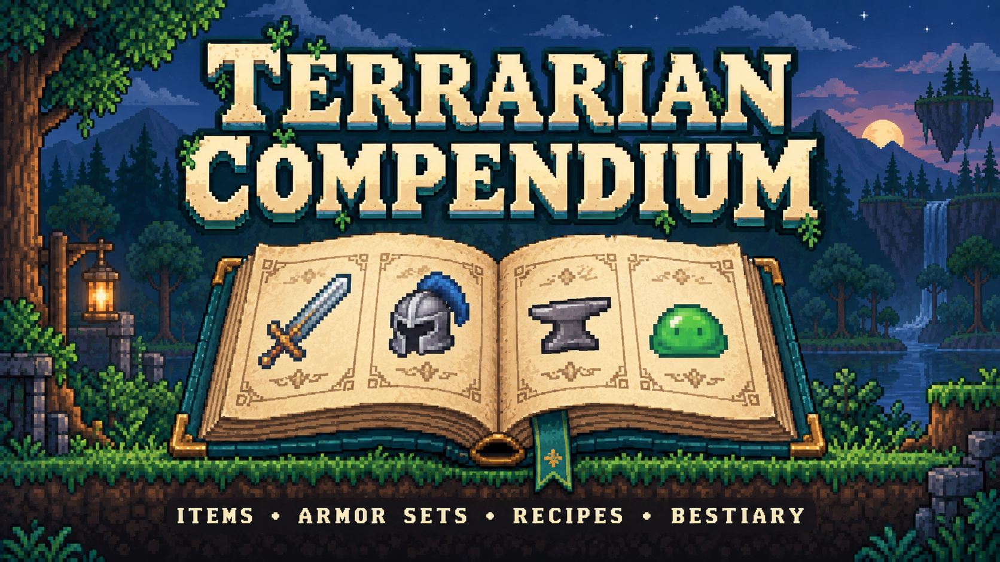

# Terrarian Compendium



**Find what you need, see how to obtain it, and track your collection.**

[Download on Nexus Mods](https://www.nexusmods.com/terraria/mods/245)

Terrarian Compendium adds an in-game reference and collection browser for vanilla Terraria. Browse items, armor sets, recipes and NPCs in one window, with linked details that help you follow an ingredient to its source, a drop to its enemy, or an armor piece to its set.

Use it to plan your next craft, look up an item, or work towards a complete collection. Your collection records what each character has found, even after those items leave your inventory.

## Features

- Browse **Items**, **Armor Sets**, **Recipes** and **Bestiary** in a movable, resizable window with Back and Forward navigation.
- Open supported vanilla slot items directly in the Compendium with **Alt+Right Click**, using the same Item navigation and history as the browser.
- Search item and NPC names, narrow results with category and progress filters, and choose from several sorting options. Item search can also include descriptions.
- Track your item collection for each character, spot missing items through silhouettes, and view Journey Mode research status. Fully researched items in the Compendium support native Journey duplication shortcuts.
- Explore item sources: crafting, NPC drops, potential merchant stock, chests, pots, tree shaking, fishing, and possible contents of bags, crates and other openable items.
- Check recipe ingredients, alternatives, crafting stations and other requirements. Open an item in **Recipes** to browse a contextual catalog of recipes that use it, save favorite recipes, filter by **Craftable Now**, and craft directly from item or recipe details.
- Look up armor set bonuses and valid combinations of armor pieces, including sets with multiple variants.
- Browse NPC encounter progress, habitats, debuff immunities and item drops with their chances and conditions. NPC Details can also show native kill statistics and banner progress when available. Filter NPCs by Bestiary criteria, whether they have drops, missing collection drops, and—when Journey research is available—unresearched drops. Compare Classic, Expert and Master stats for your current world's progression.

## Collection Tracking

Items are discovered from your inventory, equipment and other loadouts. With **Storage Discovery** enabled, items in supported vanilla storage are also discovered while you have that storage open.

Once an item is marked as found, it stays in that character's collection. Selling, consuming or crafting with it does not remove the discovery. In Journey Mode, you can also view and filter by research status.

## Crafting and Item Sources

Open an item or recipe, select **Craft**, then choose an available recipe. Hold its button to keep crafting. This uses your materials and follows Terraria's normal crafting requirements, including nearby stations and environmental conditions. Materials can come from your inventory and an open vanilla chest when Terraria allows it.

Merchant stock lists show what an NPC can sell and the conditions attached to those items. Check those conditions when planning a purchase: an entry in the Compendium does not mean the merchant is selling it right now.

## Settings

Press **F6** to open TerrariaModder's mod menu, then select **Terrarian Compendium**.

- **Storage Discovery** — Mark items as found while supported vanilla storage is open. Enabled by default.
- **Inventory Item Navigation** — Allow **Alt+Right Click** to open supported vanilla slot items in the Compendium. Enabled by default.

## Controls

- **Alt+I** — Open or close Terrarian Compendium while in a world.
- **Alt+Right Click** on a supported vanilla inventory-like slot — Open the hovered valid item in the Compendium. Supported surfaces are the main inventory, coin/ammo slots, an open chest or personal storage, equipment/vanity/dye/misc-equipment slots, and the current NPC shop.
- **Alt+Left Click** on a fully researched Item inside the Compendium — Duplicate its native Journey stack.
- **Alt+Right Click** on a fully researched Item inside the Compendium — Duplicate one Item; hold the button to repeat with Terraria's native cadence.
- **Alt+Left Click** on the category up arrow in **Items** or **Recipes** — Return directly to that section's root.

You can rebind **Toggle Terrarian Compendium** in TerrariaModder's **F6** menu. The vanilla-slot **Alt+Right Click** navigation shortcut is fixed and is controlled by **Inventory Item Navigation**. That setting does not disable Journey duplication actions inside the Compendium.

## Requirements

- **Terraria 1.4.5.8** for Windows.
- [TerrariaModder Core](https://www.nexusmods.com/terraria/mods/135) **0.4.1**.
- **.NET Framework 4.8**.

## Installation

1. Install the required version of TerrariaModder Core using the instructions on its download page. Close Terraria before copying mod files.
2. Download the main file from the [Files tab on Nexus Mods](https://www.nexusmods.com/terraria/mods/245?tab=files) and extract the archive.
3. Inside your Terraria installation folder, which contains `Terraria.exe`, create `TerrariaModder\mods\terrarian-compendium\` if needed. Place `TerrarianCompendium.dll` and `manifest.json` directly inside that mod folder.
4. Launch the game through `TerrariaInjector.exe` in your Terraria installation folder.
5. Enter a world and press **Alt+I** to open the Compendium.

## Compatibility

### Existing characters and worlds

You can use the mod with an existing character and world. Collection tracking picks up items you currently carry, equip or access through opened storage; it cannot reconstruct a complete history of everything collected before installation.

### Removing the mod

Close Terraria and remove the `terrarian-compendium` mod folder to disable its interface and tracking. The mod adds no custom items, NPCs or world generation to your characters or worlds. Its separately stored collection records and recipe favorites remain on disk.

### Multiplayer

The interface and collection tracking belong to the local player. Collection records and recipe favorites are not shared between players. Host & Play has been tested, including crafting from inventory and an open vanilla chest. Other multiplayer setups have not been fully verified.

### Saved progress

Local and Steam Cloud versions of a character keep separate collection records. Recipe favorites are shared by characters using the same Terraria save folder and are not synchronized between installations.

### Other mods

Built for vanilla Terraria through TerrariaModder.

### Known TerrariaModder UI limitation

With TerrariaModder Core 0.4.1, holding Terraria's Favorite/loadout-share modifier over certain non-empty inventory or equipment slots can temporarily hide the Compendium. The window returns after the modifier is released or the cursor leaves the affected slot. This also occurs when **Inventory Item Navigation** is disabled; Terrarian Compendium does not apply a local workaround for this framework/runtime interaction.

## Languages

- English.
- Russian.

The mod interface follows Terraria's language setting, with English as the fallback for other languages. Vanilla item names, descriptions and NPC names use the game's current language.

## Development

The solution contains the production project and a separate NUnit test project.

Run the automated test suite with:

```powershell
dotnet test tests/TerrarianCompendium.Tests/TerrarianCompendium.Tests.csproj -c Release
```

Deterministic project-owned behavior belongs in automated tests. Terraria, TerrariaModder, XNA, and other runtime-owned behavior is validated through in-game acceptance scenarios.

See [Architecture](docs/architecture.md) for architecture boundaries and [Testing policy](docs/testing.md) for the testing policy.

## Links

- [Nexus Mods page](https://www.nexusmods.com/terraria/mods/245).
- [GitHub Releases](https://github.com/EscarvalOokt/TerrarianCompendium/releases).

Feedback and bug reports are welcome.